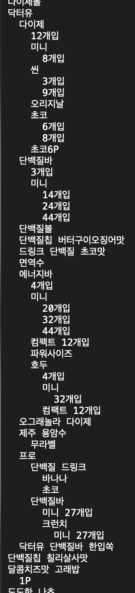

> Date: 2024-07-01

### What I Learned

- 항해 99 - 1일차 [N^2 배열 자르기 풀이](https://school.programmers.co.kr/learn/courses/30/lessons/87390?language=python3)
  - 수학에 관련된 문제였는데, 어려웠다. 그래도 자력으로 풀어서 다행. - 2차원 배열로 주어지는 문제였는데 곧이 곧대로 받아들여 2차원 배열 중 정답이 있는 영역만 생성한 뒤 slice해서 풀었는데 패턴을 발견해서 푸신 분들이 많은듯.
- 알고리즘 스터디 - [BOJ 2580](https://www.acmicpc.net/problem/2580)
  - 백트래킹 관련 문제. 요번주 알고리즘 스터디 문제.
  - 골드 4문제라 어렵다. 이해는 했지만 숫자를 놓을 수 있는 조건과 백트래킹을 어떻게 활용해야 하는지 제대로 파악을 못해 구현에 어려움을 겪었다.
- 해당 문서를 포함해 항해99을 진행하면서 매일 TIL문서를 올릴 예정이다. 매일매일 열심히 기록해보기!
- 사이드 프로젝트에서 사용하기 위해 상품을 매칭하는 방법을 계속 고민중.
  - 다나와에서 수집한 상품 이름 중 의미있는 단어를 추출하기 위해 상품명에 중복되는 단어들로 trie를 만들어봄
  - 입력으로 들어오는 텍스트로 공백 기준으로 나누어서 얼마나 많이 매칭되는지 확인 해봐야 할 듯.

### Why It Is Important

- N/A

### How I Can Use It

- N/A

### References

- N/A
