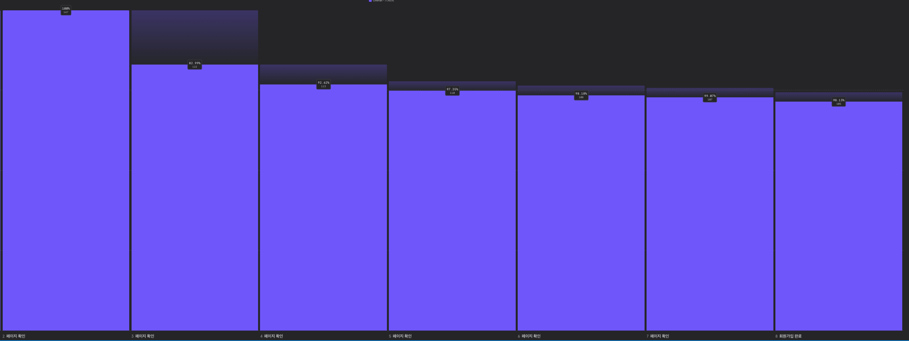

> Date: 2024-07-23

### What I Learned

- 항해 99 - 2일차 [x만큼 간격이 있는 n개의 숫자](https://github.com/tjsry0466/algorithm-study/blob/main/programmers/x%EB%A7%8C%ED%81%BC%20%EA%B0%84%EA%B2%A9%EC%9D%B4%20%EC%9E%88%EB%8A%94%20n%EA%B0%9C%EC%9D%98%20%EC%88%AB%EC%9E%90.py)
  - 연습 문제라 바로 풀었다.
- 사이드 프로젝트(지름알림)
  - 상품 정보를 trie로 구조화한 데이터로 검색해 13만개의 상품중 6000개 가량의 상품을 매칭하는데 성공했다.
  - 정확도를 높이는 방법을 몇개 생각해둔게 있어서 하나씩 적용해보면서 정확도를 높여볼 예정.
  - 온보딩 과정의 약간 동의 화면에서 `18%` 의 이탈이 일어나는걸 확인해서 약간 동의 화면을 뒤쪽으로 이동시키고 보기 버튼을 시각적으로 덜 중요해 보이도록 변경하고 UX적으로 조금 더 편하게 확인 할 수 있도록 변경하기로 결정했다.
    

### Why It Is Important

- N/A

### How I Can Use It

- N/A

### References

- N/A
