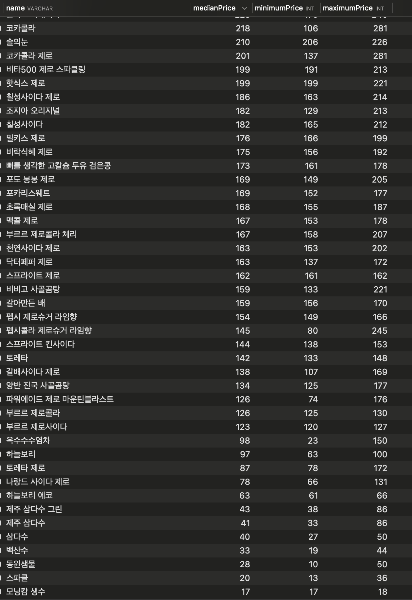

> Date: 2024-08-07

### What I Learned

- 항해 99 - 17일차 [촌수계산](https://github.com/tjsry0466/algorithm-study/blob/main/BOJ/2644.py)
- 사이드 프로젝트(지름알림)
  - 매칭된 상품으로 이상치 제거 후 중앙값, 최소값, 최대값 추출
  - 매칭된 일부 상품에 한해서 가격 요약 정보 보여줄 수 있을듯
  - 

### Why It Is Important

- N/A

### How I Can Use It

- N/A

### References

- N/A
